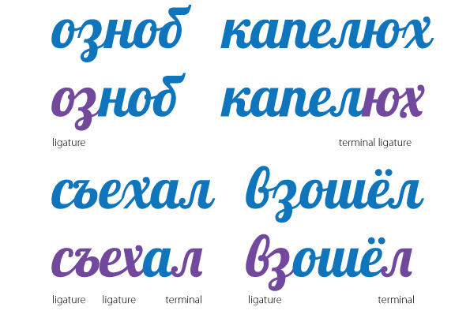
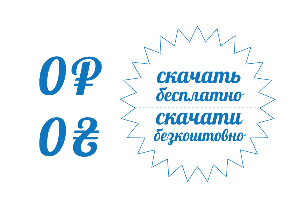

### Lobster Cyrillic ###
>> Cyrillic version of the popular Lobster font by Pablo Impallari (impallari.com)

_Features:_ 
* 99 Cyrillic ligatures
* 25 ending glyphs
* 100 ending ligatures
* 2 initial ligatures

_Supported Languages (Cyrillic-based):_
: Russian, Bulgarian, Balkar, Nanai, Nogai, Erzya, Karachay-Balkar, Kumyk, Moksha, Crimean Tatar (Cyrillic)
Belarusian (Cyrillic), Macedonian, Rusyn, Serbian (Cyrillic), Ukrainian

Released 2011.03.06

Designers: Gayaneh Bagdasaryan, Alexei Vanyashin